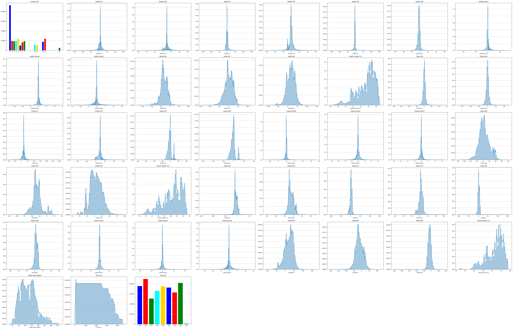
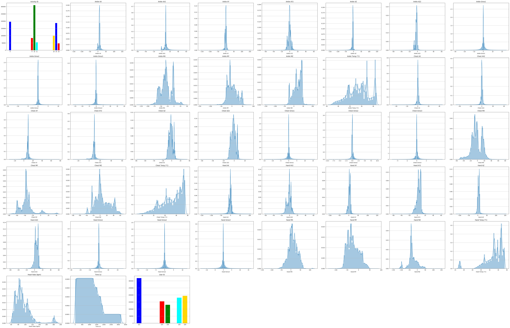

# FINAL PROJECT - IJCERNICHARO
## Index
* [1. Description](#1\.-description)
* [2. Data Acquisition](#2\.-data-acquisition)
* [3. Data Exploration](#3\.-data-exploration)
* [4. Data cleaning and wrangling](#4\.-data-cleaning-and-wrangling)
* [5. Model Training and Evaluation](#5\.-model-training-and-evaluation)
* [6. Model Validation](#6\.-model-validation)
* [7. Conclusion](#7\.-conclusion)
<br>

___
## 1. Description

**SOURCE**: [PAMAP2 Physical Activity Monitoring Data Set](https://archive.ics.uci.edu/ml/datasets/PAMAP2+Physical+Activity+Monitoring)

Data Set Information:

The PAMAP2 Physical Activity Monitoring dataset contains data of 18 different physical activities (such as walking, cycling, playing soccer, etc.), performed by 9 subjects wearing 3 inertial measurement units and a heart rate monitor. The dataset can be used for activity recognition and intensity estimation, while developing and applying algorithms of data processing, segmentation, feature extraction and classification.

**Sensors**<br>
3 Colibri wireless inertial measurement units (IMU):
- sampling frequency: 100Hz
- position of the sensors:
- 1 IMU over the wrist on the dominant arm
- 1 IMU on the chest
- 1 IMU on the dominant side's ankle
HR-monitor:
- sampling frequency: ~9Hz

**Data collection protocol**<br>
Each of the subjects had to follow a protocol, containing 12 different activities. The folder `Protocol` contains these recordings by subject.
Furthermore, some of the subjects also performed a few optional activities. The folder `Optional` contains these recordings by subject.

**Data files**<br>
Raw sensory data can be found in space-separated text-files (.dat), 1 data file per subject per session (protocol or optional). Missing values are indicated with NaN. One line in the data files correspond to one timestamped and labeled instance of sensory data. The data files contain 54 columns: each line consists of a timestamp, an activity label (the ground truth) and 52 attributes of raw sensory data.

Attribute Information:

The 54 columns in the data files are organized as follows:
* 1     timestamp (s)
* 2     activityID (see below for the mapping to the activities)
* 3     heart rate (bpm)
* 4-20  IMU hand
* 21-37 IMU chest
* 38-54 IMU ankle

The IMU sensory data contains the following columns:
* 1      temperature (°C)
* 2-4    3D-acceleration data (ms-2), scale: ±16g, resolution: 13-bit
* 5-7    3D-acceleration data (ms-2), scale: ±6g, resolution: 13-bit
* 8-10   3D-gyroscope data (rad/s)
* 11-13  3D-magnetometer data (μT)
* 14-17  orientation (invalid in this data collection)

List of activityIDs and corresponding activities:
* 1 lying
* 2 sitting
* 3 standing
* 4 walking
* 5 running
* 6 cycling
* 7 Nordic walking
* 9 watching TV
* 10 computer work
* 11 car driving
* 12 ascending stairs
* 13 descending stairs
* 16 vacuum cleaning
* 17 ironing
* 18 folding laundry
* 19 house cleaning
* 20 playing soccer
* 24 rope jumping
* 0 other (transient activities)

**Relevant Papers:**

The following two publications describe the dataset and provide a baseline benchmark on various tasks of physical activity recognition and intensity estimation:

[1] A. Reiss and D. Stricker. Introducing a New Benchmarked Dataset for Activity Monitoring. The 16th IEEE International Symposium on Wearable Computers (ISWC), 2012.

[2] A. Reiss and D. Stricker. Creating and Benchmarking a New Dataset for Physical Activity Monitoring. The 5th Workshop on Affect and Behaviour Related Assistance (ABRA), 2012. 
<br>

___
## 2. Data Acquisition
First of all is to download the dataset from the URL I have provided below and decompress the data. What we find is that we have 2 folders of data (`Protocol` and `Optional`) and 4 documents describing the dataset, the activities and some factors to take in count.<br><br>
Protocol and Optional files together make 1.7 GB of data. Since I do not have a workstation and I have limited RAM (8GB + 2GB of SWAP partition) I have to be careful when loading data. Avoid duplicities and just have the needed data in my work enviroment each moment. <br><br>
My workflow open these files in a loop and concatenate them into a two final dataframes, `final_data` and `final_data_optional`
<br>

___
## 3. Data Exploration
One of the best factors of this dataset is that all our Features are numerical, and only 2 of them are categorical. These makes reference to the `user ID` (This one has been defined by myself for analysis purpouses) and to the `activity ID`. <br><br>
For the numerical Features, we have 12 of them that are invalid to this study, does not make any sense. These features are the one for the orientation and in my workflow are named as `Hand O1`,`Hand O2`,`Hand O3`,`Hand O4`,`Chest O1`,`Chest O2`,`Chest O3`,`Chest O4`,`Ankle O1`,`Ankle O2`,`Ankle O3`, and `Ankle O4`. This step reduces from 55 to 43 Features.<br><br>
Next step is to see the distribution of our variables:<br><br>
**Protocol Dataframe Features**<br>
<br><br>
**Optional Dataframe Features**<br>
<br><br>
As we can observe, `Activity ID == 0` has the major number of registers. We can see the difference of activities in each dataframe, for Optional dataframe there are less activities and registers. Also, we can observe the Heart Ratio has very low number of registers compared to the rest of the Features.
<br>

___
## 4. Data cleaning and wrangling
First step is to interpolate the `Heart Rate` Feature to fill the 90% of missing data for this Feature (These are taken with a lower frequency so that is the why are less values).<br><br>
As you can see in the next 2 figures, once **interpolated** the results fits with the activities that subjects are told to do.<br><br>
**Protocol Activities Time Series**<br>
<br><br>
**Optional Activities Time Series**<br>
<br><br>
Registred time is higher in Protocol Activities Dataset than in Optional Activities dataset<br><br>
Next step is to deal with missing values. We are goint to check how many values are missing and how they affect to the dataframes if we consider that one register with one missing value, taking in count that we have 43 Features, is consider as null.<br><br>
```
Protocol DF >> N NaN rows for Heart Rate:  46  | Total rows:  2872533  | % of NaN rows:  0.0016
Protocol DF >> NaN rows:  27665  | Original rows:  2872533  | % of NaN rows:  0.96

Optional DF >> N NaN rows for Heart Rate:  54  | Total rows:  977972  | % of NaN rows:  0.0055
Optional DF >> NaN rows:  3493  | Original rows:  977972  | % of NaN rows:  0.36
```
My choice is to delete all these `NaN` values. Of course they could be filled with other options. **I am open to any suggestion for this step**.<br><br>
Once I have managed to drop all `NaN` values I have to drop even more. Why? Because the next note of the authors of the original Study:
```
Data labeled with activityID=0 should be discarded in any kind of analysis. This data mainly covers transient activities between performing different activities, e.g. going from one location to the next activity's location, or waiting for the preparation of some equipment. Also, different parts of one subject's recording (in the case when the data collection was aborted for some reason) was put together during these transient activities (noticeable by some “jumping” in the HR-data).
```
This step is going to remove many data. This Activity has many registers involved as you can see below:<br>
```
Protocol DF rows for activity 0:  923391  > Total rows of the DF:  2844822  > 32.46 % of bad Data
Optional DF rows for activity 0:  194846  > Total rows of the DF:  974425   > 20.0 % of bad Data
```
<br>
Also, I have made dropped the Users ID because is not longer needed in the study.<br><br>

**Collinearity Study**

<br>

___
## 5. Model Training and Evaluation

<br>

___
## 6. Model Validation

<br>

___
## 7. Conclusion

<br>

___

